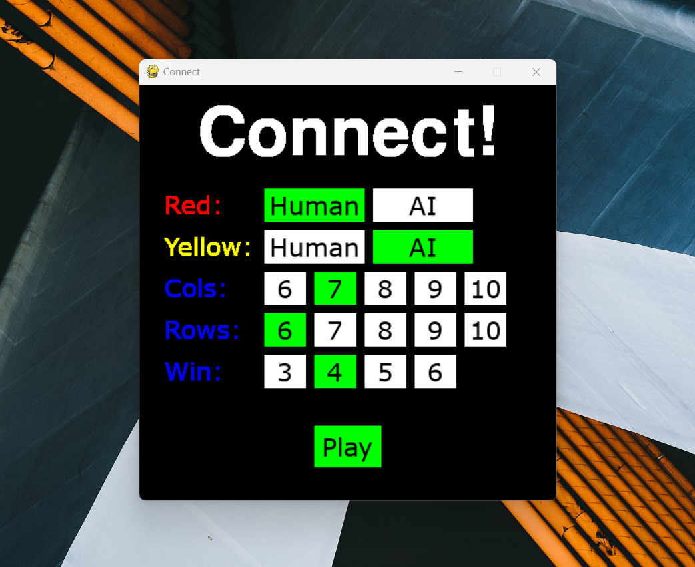
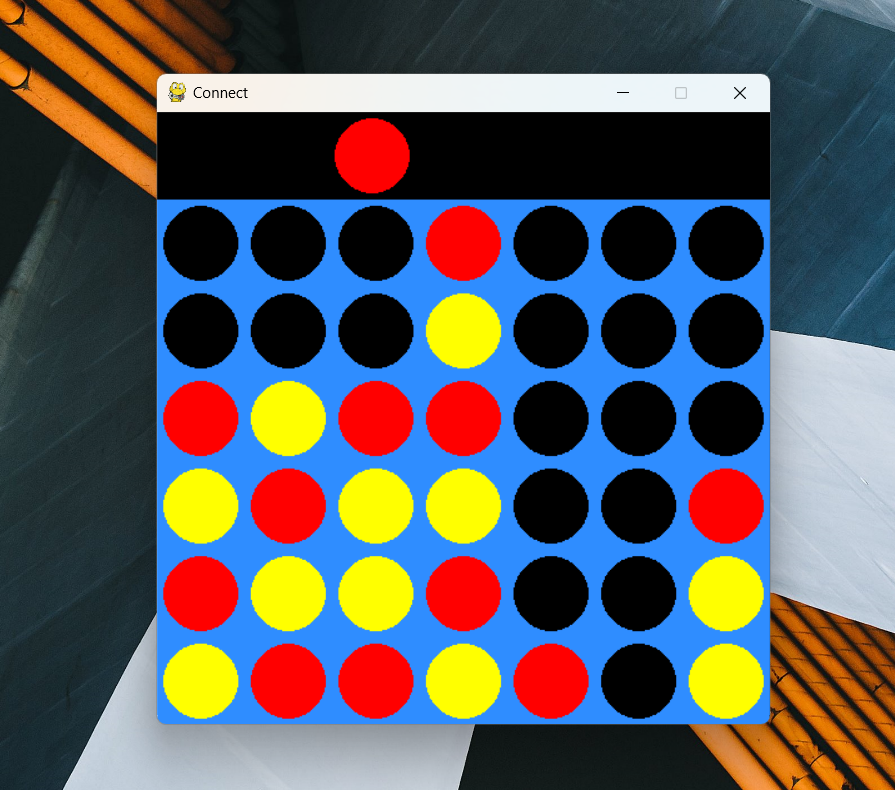

# Connect Four AI

## Description

This is a Python desktop application that allows users to play the classic game of Connect 4. It features a graphical user interface (GUI) designed with the PyGame library, enabling an intuitive and enjoyable gaming experience. Users can play against each other or challenge the built-in AI, which utilizes the minimax algorithm for intelligent move selection.

This project takes inspiration from [Keith Galli's Connect Four AI Tutorials](https://www.youtube.com/playlist?list=PLFCB5Dp81iNV_inzM-R9AKkZZlePCZdtV) and adds new features!

## Features

- **Connect 4 Gameplay:** Enjoy a game of Connect 4 with a friend or play against the AI.
- **Minimax Algorithm AI:** Challenge a smart AI opponent that uses the minimax algorithm for strategic move decisions.
- **PyGame GUI:** The game boasts a user-friendly GUI created with the PyGame library.
- **Board Manipulation:** Users can make changes to the Connect 4 board.

## Screenshots

## Installation

To run the application, follow these steps:

1. Clone this repository: `git clone https://github.com/joewil08/ConnectFour.git`
2. Navigate to the project directory: `cd ConnectFour`
3. Install dependencies: `pip install -r requirements.txt`
4. Run the game: `python main.py`

## Usage

1. Launch the application by running `main.py`.
2. Decide the game settings: player types, columns and rows, and number of pieces to connect.
3. Click the "Play" button to begin.
4. Make your moves by clicking on the desired column in the GUI.
5. The game will display the winner or declare a draw when appropriate before returning to the main menu.

## Dependencies

- [PyGame](https://github.com/pygame/pygame): Used to create the easy-to-use GUI.
- [NumPy](https://github.com/numpy/numpy): Used to represent the board.
